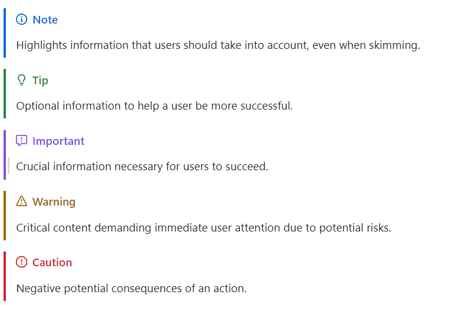

# markdown-github-alerts

Adds support for GitHub's Alerts using [markdown-it-github-alerts](https://github.com/antfu/markdown-it-github-alerts?tab=readme-ov-file)

## Preview:



### Usage Example

```
> [!NOTE]
> Highlights information that users should take into account, even when skimming.

> [!TIP]
> Optional information to help a user be more successful.

> [!IMPORTANT]
> Crucial information necessary for users to succeed.

> [!WARNING]
> Critical content demanding immediate user attention due to potential risks.

> [!CAUTION]
> Negative potential consequences of an action.
```
